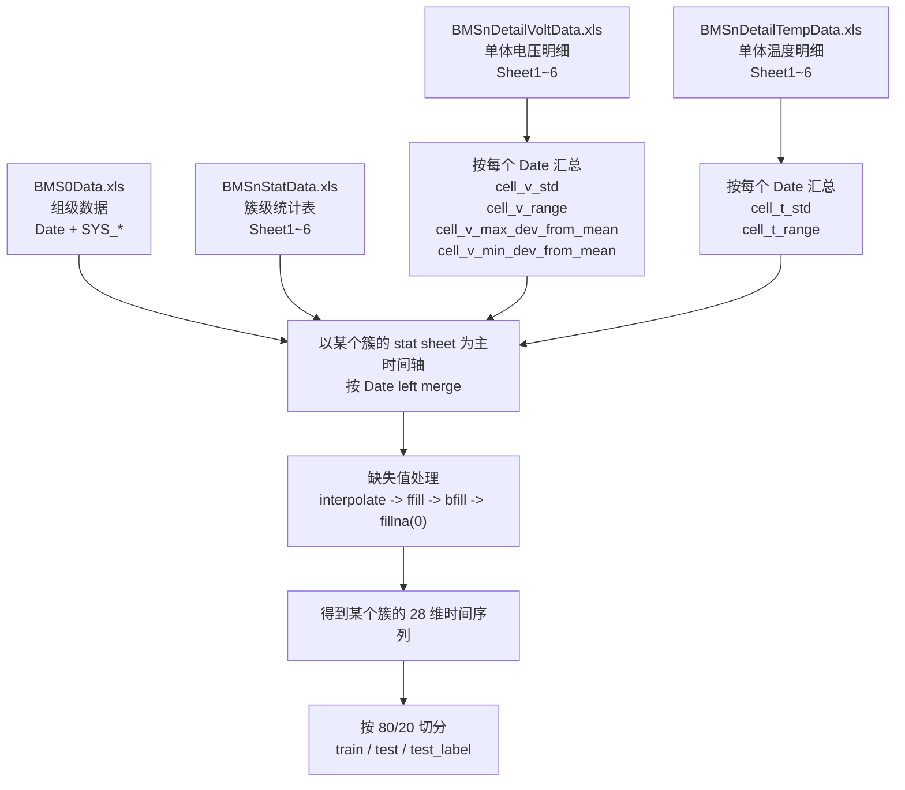

# BMS Data Alignment Flow

这份说明对应当前 `preprocess.py` 里的 BMS 预处理实现，目标是解释：

- 不同来源的数据如何整合
- 时间步是否对齐
- 组级和单体级信息如何挂到簇级时间轴上

## 1. 总体流程图



## 2. 主时间轴是谁

- 主时间轴是 `BMSnStatData.xls` 的某个 `Sheet`
- `Sheet1~6` 分别对应 6 个簇
- 每次构造一个簇的数据时，都会先取这个簇自己的 `Date` 和簇级主特征
- 所以最终每一行样本的“主体”都是某个簇在某个时刻的状态

对应代码：

- `_build_bms_cluster_feature_frame()` 里先从 `stat_df` 取主表
- 见 [preprocess.py](file:///d:/作业/论文复现/基线模型/mtad-gat-pytorch/preprocess.py#L102-L120)

## 3. 四类数据分别提供什么

### 3.1 簇级主特征

来自 `BMSnStatData.xls` 的对应 sheet：

- `BMSnVol_T`
- `BMSnVol_B`
- `BMSnI`
- `BMSnRSOC`
- `BMSnSOH`
- `BMSnICMax`
- `BMSnIDMax`
- `BMSnVmax`
- `BMSnVmin`
- `BMSnVmean`
- `BMSnTmax`
- `BMSnTmin`
- `BMSnTmean`
- `BMSnETmax`
- `BMSnETmean`

这部分是“簇级主分析”的核心。

### 3.2 单体电压摘要

来自 `BMSnDetailVoltData.xls` 的对应 sheet。

不是把所有单体电压列直接拼进去，而是对同一个 `Date` 的所有单体电压做摘要：

- `cell_v_std`
- `cell_v_range`
- `cell_v_max_dev_from_mean`
- `cell_v_min_dev_from_mean`

含义：

- `cell_v_std`：单体电压离散程度
- `cell_v_range`：单体电压最大最小差
- `cell_v_max_dev_from_mean`：最高单体相对均值偏差
- `cell_v_min_dev_from_mean`：最低单体相对均值偏差

### 3.3 单体温度摘要

来自 `BMSnDetailTempData.xls` 的对应 sheet。

同样先做摘要，再并到簇级主表：

- `cell_t_std`
- `cell_t_range`

含义：

- `cell_t_std`：单体温度离散程度
- `cell_t_range`：单体温度最大最小差

### 3.4 组级上下文

来自 `BMS0Data.xls`：

- `SYS_Vol`
- `SYS_I`
- `SYS_SOH`
- `SYS_Vmax`
- `SYS_Vmin`
- `SYS_Tmax`
- `SYS_Tmin`

这部分不是主分析对象，而是作为系统层背景信息，挂到每个簇的时间步上。

## 4. 时间对齐方式

当前代码的时间对齐规则是：

1. 每张表都先把 `Date` 转成时间类型
2. 删除非法时间
3. 按 `Date` 排序
4. 对重复 `Date` 只保留最后一条
5. 以当前簇的 `stat_df` 为主表
6. 其他表都按 `Date` 用 `left merge`

对应代码：

- `_load_bms_excel()`
- `_build_bms_cluster_feature_frame()`
- 见 [preprocess.py](file:///d:/作业/论文复现/基线模型/mtad-gat-pytorch/preprocess.py#L67-L75)
- 见 [preprocess.py](file:///d:/作业/论文复现/基线模型/mtad-gat-pytorch/preprocess.py#L102-L120)

## 5. 缺失值怎么处理

如果某个来源在某个 `Date` 没有值，当前代码会：

1. 先保留该时间步
2. 缺失位置记成 `NaN`
3. 用插值补齐：`interpolate(limit_direction="both")`
4. 再做前向填充：`ffill()`
5. 再做后向填充：`bfill()`
6. 最后仍为空的补 `0.0`

所以这套逻辑是：

- 优先按真实 `Date` 对齐
- 如果少量时刻对不上，再用补值兜底

## 6. 当前这一天数据的实际抽查结论

抽查文件：

- `A1-1-2_StartDate_2023-07-02 000009_BMS0Data.xls`
- `A1-1-2_StartDate_2023-07-02 000009_BMSnStatData.xls`
- `A1-1-2_StartDate_2023-07-02 000009_BMSnDetailTempData.xls`
- `A1-1-2_StartDate_2023-07-02 000009_BMSnDetailVoltData.xls`

抽查结果：

- `Sheet1~6` 六个簇，四类表的时间戳都是完全一致的
- 每张表都是 `8630` 个时间点
- 时间范围一致：
  - 起点：`2023-07-02 00:00:05`
  - 终点：`2023-07-02 23:59:48`
- 对每个簇都有：
  - `stat ∩ group ∩ temp ∩ volt = 8630`
  - `stat - group = 0`
  - `stat - temp = 0`
  - `stat - volt = 0`

这说明对当前这一天数据来说：

- 时间步是严格一一对齐的
- 不是靠插值才拼出来的
- 插值逻辑目前更像“通用兜底机制”

## 7. 一行样本的含义

你可以把最终每一行样本理解成：

```text
某个簇在某个 Date 的簇级状态
+ 该簇内部单体电压离散性
+ 该簇内部单体温度离散性
+ 同一时刻系统整体上下文
```

例如一行可能是：

```text
Date = 2023-07-02 13:54:20

簇级主状态:
- BMSnI
- BMSnRSOC
- BMSnVmax / BMSnVmin / BMSnVmean
- BMSnTmax / BMSnTmean

单体摘要:
- cell_v_std
- cell_v_range
- cell_t_std
- cell_t_range

组级上下文:
- SYS_Vol
- SYS_I
- SYS_Vmax
- SYS_Tmax
```

## 8. 当前方案的定位

当前整合方式就是你之前说的：

- `簇级主分析`
- `单体级辅助`
- `组级辅助`

具体体现在：

- 样本行由簇级 `stat` 决定
- 单体明细不直接展开，而是压缩成摘要统计
- 组级量不单独建模，而是作为上下文附加到簇级样本

## 9. 一句话总结

当前 `BMS` 预处理不是把四类表简单横向乱拼，而是：

- 先用某个簇的 `Date` 建立主时间轴
- 再把单体明细压缩成簇内离散性特征
- 再把组级量作为同一时刻上下文挂上去
- 最后得到每个簇一条独立的 28 维时间序列
