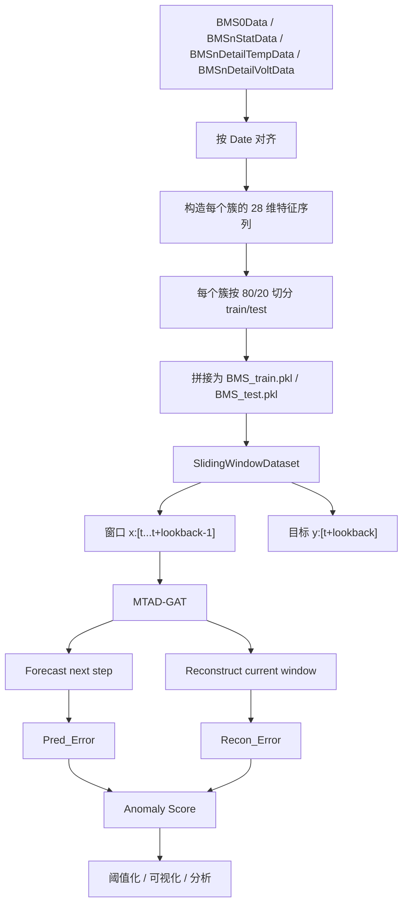
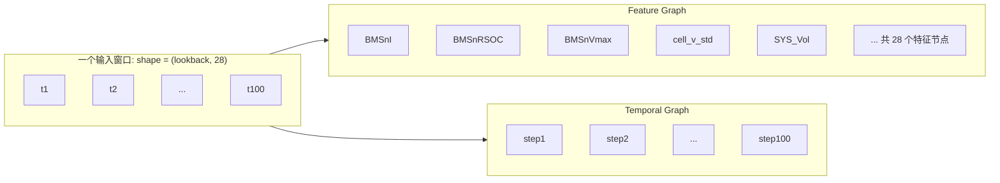
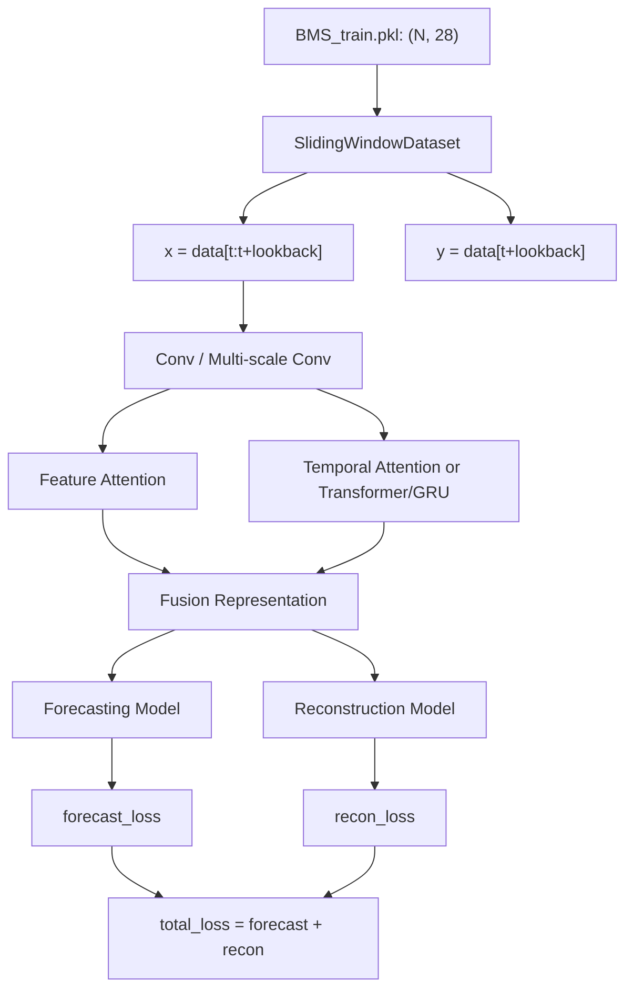

# BMS in MTAD-GAT

这份说明对应当前项目中 `BMS` 数据接入 `MTAD-GAT` 的真实实现，重点回答 4 个问题：

- `BMS` 的评估逻辑和其他数据集是否一样
- 当前图结构到底是什么
- 图节点是怎么定义的
- 训练和结果分析分别怎么做

## 1. 一句话结论

- `BMS` 的训练流程与 `SMAP/MSL` 基本一致，都是滑窗预测加窗口重构。
- `BMS` 的评估逻辑与 `SMAP/MSL` 不完全一样，因为当前 `BMS` 没有真实异常标签。
- 当前图结构不是“每个簇一个节点”，而是“每个特征一个节点”。
- `簇` 在当前实现里是时间序列来源单位，不是图神经网络里的 node。

## 2. 当前数据流

## 3. 当前图结构

说明：

- `Feature Graph` 的节点数 = `28`
- `Temporal Graph` 的节点数 = `lookback`
- 当前并没有建立“6 个簇之间的图”

## 4. 节点怎么定义

### 4.1 特征图节点

每个节点代表一个特征在整个窗口内的轨迹。

例如：

- 节点 `BMSnI` 表示最近 `lookback` 个时间步的电流序列
- 节点 `cell_v_std` 表示最近 `lookback` 个时间步的单体电压离散度序列
- 节点 `SYS_Vol` 表示最近 `lookback` 个时间步的组级总电压序列

也就是说，节点不是“某个簇”，而是“某个变量”。

### 4.2 时间图节点

每个节点代表窗口中的一个时间步。

例如当 `lookback=100` 时：

- `step1`
- `step2`
- ...
- `step100`

每个时间步节点携带该时刻的全部 `28` 维特征。

## 5. 簇在当前实现里是什么角色

`cluster1~cluster6` 当前不是图节点，而是：

- 一条条独立构建出来的簇级时间序列
- 预处理阶段的数据组织单位
- 分析阶段的可视化单位

所以当前实现更准确的说法是：

- `簇级建样本`
- `特征级建图`

而不是：

- `簇级建图`

## 6. 当前训练方式

当前 `BMS` 使用：

- 输入维度：`28`
- 目标维度：`None`
- 含义：`28 个特征全部参与预测和重构`

## 7. 评估逻辑和其他数据集一样吗

## 7.1 一样的部分

`BMS` 和 `SMAP/MSL` 一样，也会经过下面这条通路：

- 先算每个特征的预测误差
- 再算每个特征的重构误差
- 组合成每个特征的异常分数
- 再对所有特征求平均，得到 `A_Score_Global`
- 再根据训练集分数估计阈值

也就是说，`模型输出机制`和`分数计算方式`是一样的。

## 7.2 不一样的部分

关键差异在于标签：

- `SMAP/MSL` 有真实异常标签
- `NASA` 没有标准点级异常标签，所以更依赖误差趋势和循环级分析
- `BMS` 当前 `test_label` 是全 0 占位，不是真实标签

因此：

- `SMAP/MSL` 可以认真看 `Precision / Recall / F1`
- `BMS` 不能把这些指标当成真正有效的监督评估结果

所以 `BMS` 当前更适合做的是：

- 异常分数趋势分析
- 不同簇的对比分析
- 与电压/温度离散性特征的物理一致性分析
- 高分时段定位和案例解释

## 8. 当前更适合怎么汇报 BMS 结果

如果写到论文里，建议把 `BMS` 定位成：

- `真实工业无标签场景验证`

而不是：

- `和 SMAP/MSL 完全同口径的 benchmark`

更合适的展示内容是：

- 簇级异常分数趋势图
- 关键特征联动图
- 各簇训练/测试分布变化
- 高分时段与物理量变化的一致性解释

## 9. 一句话总结

当前 `BMS` 在 `MTAD-GAT` 里的真实实现是：

- `按簇组织数据`
- `按特征建图`
- `按滑窗训练`
- `按无监督异常分数分析结果`

所以当前它不是“每个簇一个节点的图模型”，而是“簇级多变量时间序列上的特征图异常检测模型”。
