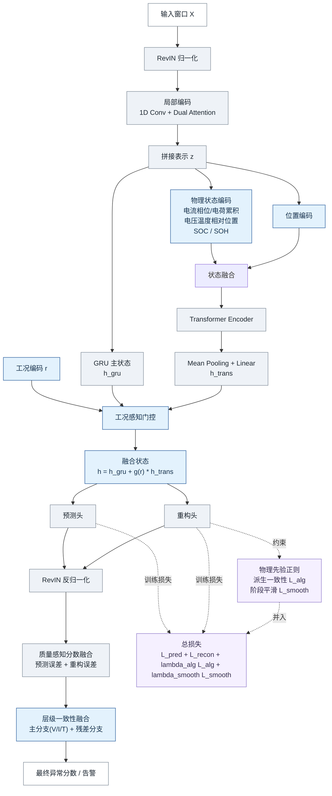
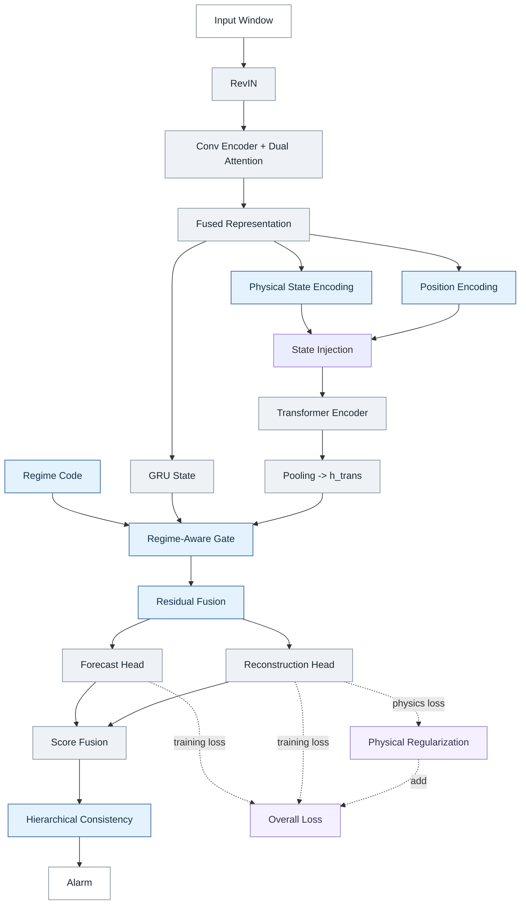

# 第四章论文版模型总览图

这版对应第四章增强模型，重点突出 3 个新增部分：

- 物理状态编码 `Physical State Encoding`
- 物理先验正则 `Physical Regularization`
- 层级一致性融合 `Hierarchical Consistency`

建议标题：

- `图 X  融合物理状态编码与层级一致性的工况感知异常检测框架`

## 中文论文版

## 英文精简版

## 图注建议

- 第四章在基线模型基础上引入物理状态编码，将充放电阶段、电荷累积、相对位置及 `SOC/SOH` 等状态变量注入 Transformer 分支。
- 通过工况编码生成门控系数，对 `GRU` 主状态与 Transformer 上下文进行自适应融合，以增强工况切换阶段的表征能力。
- 训练阶段加入物理先验正则，包括派生一致性约束与阶段平滑约束，以减小不合理波动。
- 推理阶段先进行质量感知分数融合，再通过主分支与残差分支的层级一致性得到最终异常分数。

## 排版建议

- 正文主图优先使用英文精简版，中文细节放图注。
- 如果版面较窄，可删去损失分支，只保留主干推理路径，把 `Physical Regularization` 画成右侧注释框。
- 若需要和第三章图统一，保留同一套配色：基线浅灰、第四章新增模块浅蓝、训练损失浅紫。
