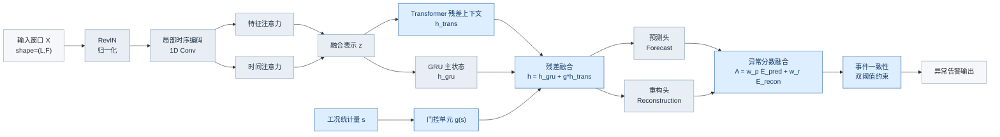
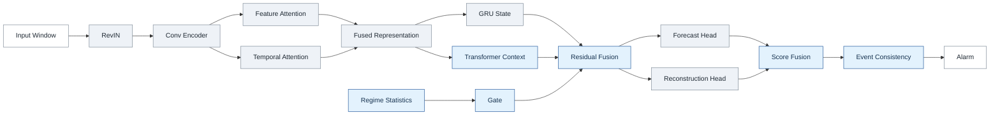
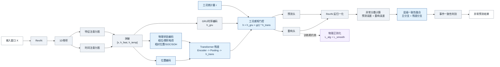

# 论文版模型总览图

下面这版是按论文正文插图风格重画的源文件：

- 标签尽量缩短，避免大段解释塞进框里
- 只保留主干数据流，不把实现细节全部堆进去
- 用浅灰表示 baseline 主干，用浅蓝表示本文增强模块
- 适合后续导出为 `SVG/PNG` 再放进论文

建议标题：

- `图 X  工况感知 Transformer 残差增强的 MTAD-GAT 总体框架`

## 图注建议

- `RevIN` 用于削弱不同工况下的统计漂移。
- `1D Conv + 特征/时间注意力` 负责提取局部时序模式与跨变量依赖。
- `GRU` 建模主时序状态，`Transformer` 提供长程上下文残差补偿。
- `工况统计量` 生成门控系数，对 Transformer 残差进行自适应调节。
- 预测误差与重构误差融合为异常分数，再经过事件一致性约束输出最终告警。

## 论文排版建议

- 正文图尽量只保留英文或“中英混排”短标签，不要在框内写公式解释句。
- 如果投稿模板是黑白打印，建议把 `ours` 统一改成浅灰蓝边框，避免高饱和黄色。
- 如果版面较窄，可改成上下两行：
  第一行 `输入 -> 编码 -> 融合 -> GRU/Transformer`
  第二行 `预测/重构 -> 分数融合 -> 事件一致性 -> 输出`

## 更简洁版本

如果你想要更像论文主图的“极简版”，可以用下面这版：

## 第四章增强版

如果你希望第四章直接按第三章第一张图的风格扩展，推荐用下面这版。它保持原有中文模块命名和横向主干，只把第四章新增内容插到对应位置：

- 在 `拼接表示` 后增加 `物理状态编码` 与 `位置编码`
- 在 `异常分数计算` 后增加 `层级一致性融合`
- 在重构分支补充 `物理正则化`

建议标题：

- `图 X  第四章物理增强与层级一致性扩展后的统一框架`

### 第四章图注建议

- 第四章在第三章模型主干上增加物理状态编码，将充放电阶段、相对位置以及 `SOC/SOH` 等状态信息注入 Transformer 分支。
- 在异常分数计算之后增加层级一致性融合，对主分支与残差分支分数进行联合约束，提升复杂工况下的稳定性。
- 重构分支在训练阶段引入物理正则化，用于约束派生一致性与阶段平滑性。

### 使用建议

- 第三章正文继续用上面的第一张主图风格。
- 第四章正文直接用这张“增强版”，整体观感会和第三章保持一致。
- 如果要更接近你原来的图，可以把 `物理状态编码` 和 `层级一致性融合` 框再加宽一点，减少换行。
