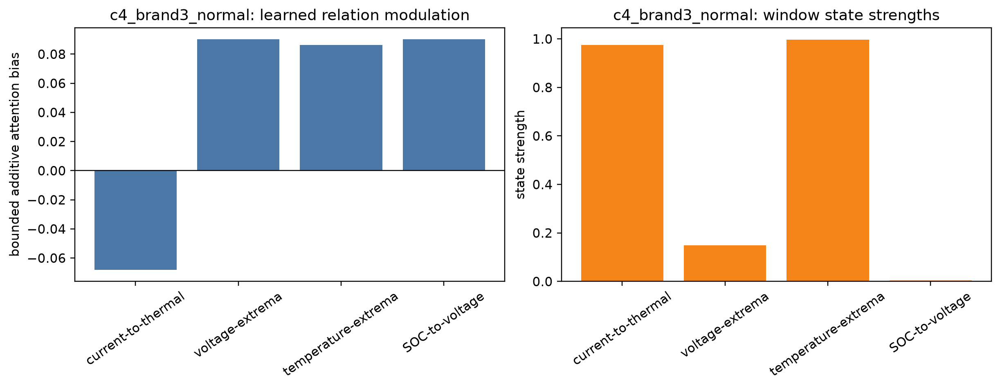
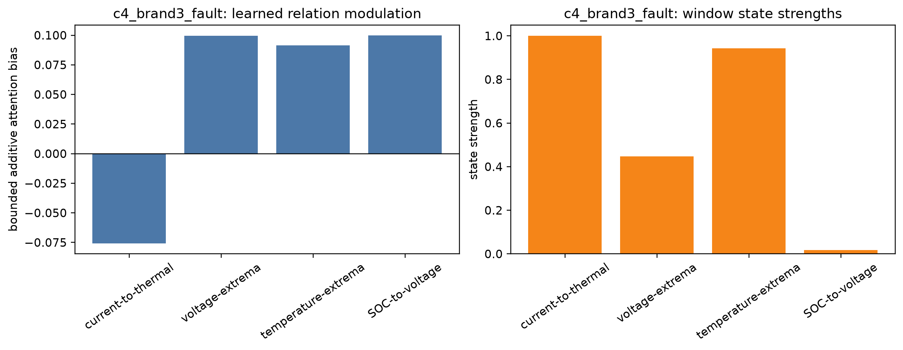
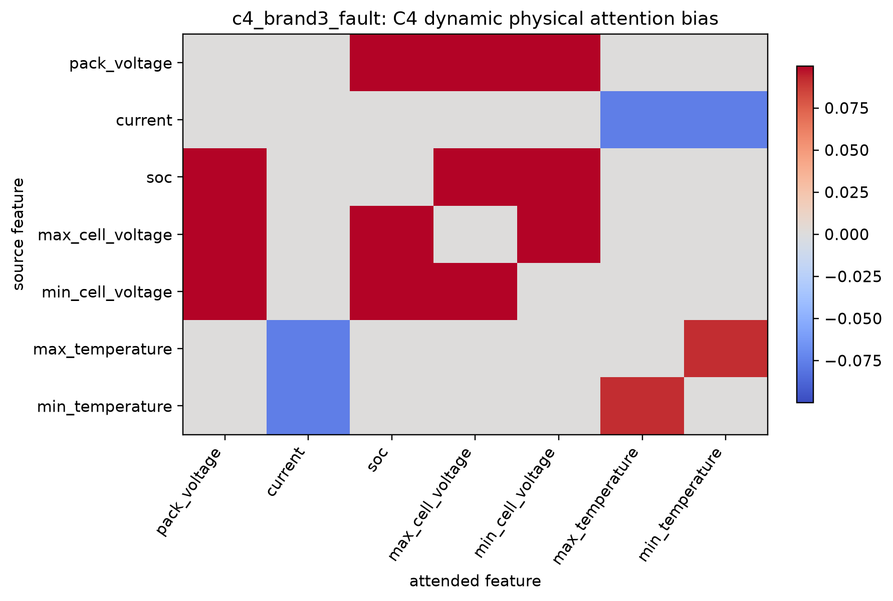
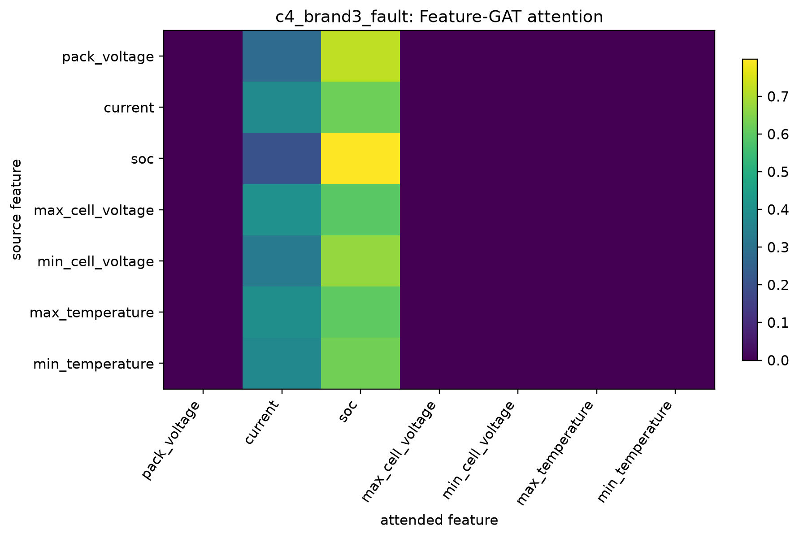
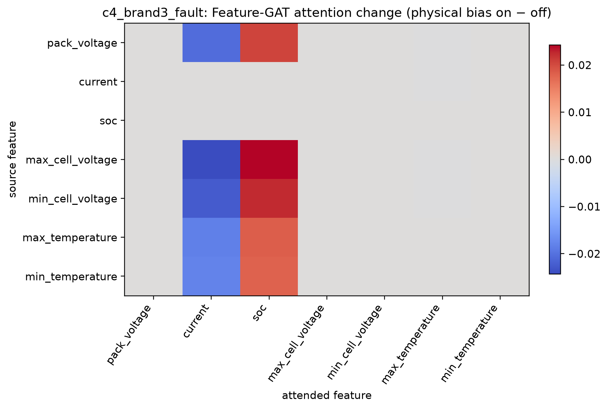
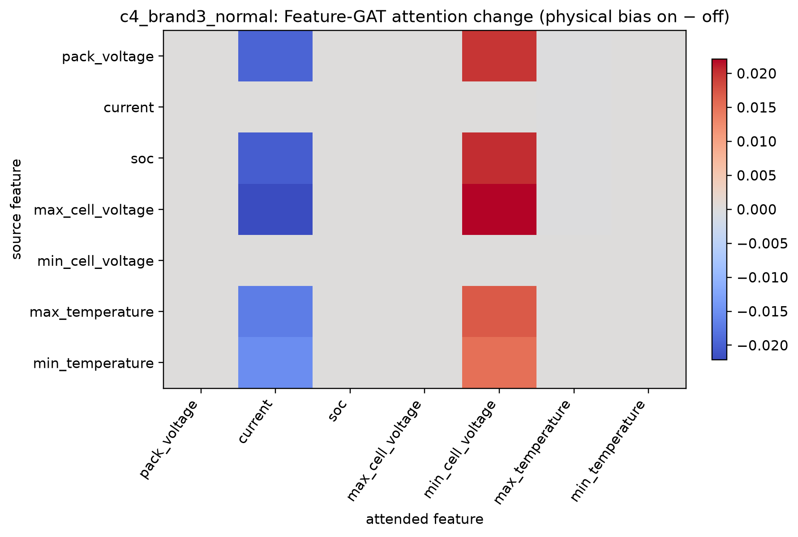

# C4 学习到的物理关系：真实门控、物理偏置与注意力图（Brand3）

## 1. 本报告回答什么

本报告不把 AP/AUROC 或异常分数曲线作为主体，而是直接读取任务 118 的**冻结 Full C4 checkpoint**，对其 Brand3 fold 1 测试窗口做确定性前向推理，展示模型内部实际使用的：

1. 四类物理关系的状态强度与有符号门控值；
2. 门控写入 Feature-GAT 前的加性物理偏置矩阵；
3. Feature-GAT 最终注意力矩阵；
4. 同一权重、同一输入下关闭物理偏置后的注意力差异（前向反事实）。

因此，图中不是手工指定的邻接矩阵，也不是根据结果“解释性绘图”反推出来的热力图；全部由冻结模型的真实缓存导出。导出过程不训练、不更新 checkpoint，也不改写正式实验指标。

> **术语澄清：C4 没有“原型”。** Prototype-Query 是 C3 的机制；C4 使用的是四类状态条件的物理关系门控。不能把 C3 的 prototype 当作 C4 的物理关系类别，也不能把本报告的 gate 叫成原型。若需要解释 C3 原型的含义，应单独从 C3 checkpoint 导出“prototype-to-channel cross-attention”，不能混入本 C4 报告。

## 2. 可复核设置与图的读法

所有图均来自：

- checkpoint：任务 118 `c4_full_conservative_f1_seed3407/model.pt`；
- 数据：Brand3、DyAD `paper_protocol` 的 fold 1 测试集；
- 正常样本：车辆 413，`data/3198.pkl`；故障样本：车辆 465，`data/28535.pkl`；
- 选择规则：各自标签下按路径排序的中位测试片段、片段中央合法窗口，**不按异常分数挑选**；
- 模型：Full conservative（动态物理图开启、响应头接入 GRU），`physical_graph_gate_scale=0.75`。

热力图的行均为**源变量**，列均为**被关注变量**。物理偏置为加到 GAT 注意力 logits 的值：红色/正值表示提高该有物理依据边的相对优先级，蓝色/负值表示降低其优先级；它们**不是变量之间的正/负相关系数**。

四类关系的物理含义如下。

| C4 关系门控 | 对应边 | 状态强度的主要来源 | 物理含义 |
|---|---|---|---|
| current-to-thermal | 电流 ↔ 最高/最低温度 | 窗口内 \(I^2\) | 负载电流与焦耳热响应是否值得在当前工况下联合建模。 |
| voltage-extrema | 包电压 ↔ 最高/最低单体电压；最高 ↔ 最低单体电压 | 平均 \(\lvert V_{max}-V_{min}\rvert\) | 单体电压离散度及其对包级电压关系的影响。 |
| temperature-extrema | 最高温度 ↔ 最低温度 | 平均 \(\lvert T_{max}-T_{min}\rvert\) | 热分布是否均匀，以及热极值是否需要成对解释。 |
| SOC-to-voltage | SOC ↔ 包电压/最高最低单体电压 | 平均 \(\lvert\Delta SOC\rvert\) | 荷电状态变化与电压响应是否保持一致。 |

门控由四个状态强度经过一个可学习的混合层得到，所以“某一关系的 state strength 高”不必然等于“同名 gate 最大”；gate 才是最终加入图注意力的、可正可负且有界的调制量。

## 3. 图 1：正常与故障窗口的真实关系门控

### 图 1a：正常窗口（车辆 413）



### 图 1b：故障窗口（车辆 465）



| 关系 | 正常状态强度 | 故障状态强度 | 正常 gate | 故障 gate | 可作出的解释 |
|---|---:|---:|---:|---:|---|
| 电流—温度 | 0.9747 | 1.0000 | −0.0682 | −0.0759 | 两个窗口都处在高负载状态；负 gate 仅表示模型在这些窗口中抑制该关系的额外注意力，不代表“电流与温度负相关”。 |
| 电压极值 | 0.1498 | **0.4479** | +0.0903 | **+0.0994** | 故障窗口的电压离散度状态强度约为正常窗口的 3 倍，模型同时将电压极值关系的注意力偏置提高。 |
| 温度极值 | 0.9966 | 0.9428 | +0.0863 | +0.0916 | 两个窗口都有较明显温差状态，模型稳定地保留该物理关系。 |
| SOC—电压 | 0.0032 | 0.0167 | +0.0902 | **+0.0999** | 该片段的 SOC 变化本身很小；但 gate 是四个状态的联合函数，模型仍将 SOC—电压关系作为正向条件边。 |

图 1 的重要信息不是“所有故障都由电压极差引起”，而是：**模型真的学到了非零、带方向、随窗口状态变化的四类门控。** 在这个未按分数挑选的故障窗口上，电压极值状态与其正向 gate 同时增强；这是从工程量到模型内部关系强度的第一段证据。

## 4. 图 2：门控在该故障窗口具体写入了哪些物理边



图 2 将图 1b 的四个标量 gate 展开为 7×7 的物理边。可以直接读到：

- `voltage-extrema=+0.0994` 为包电压—最高/最低单体电压、最高—最低单体电压提供正偏置；
- `SOC-to-voltage=+0.0999` 为 SOC—包电压、SOC—最高/最低单体电压提供正偏置；
- `temperature-extrema=+0.0916` 为最高—最低温度提供正偏置；
- `current-to-thermal=−0.0759` 为电流—最高/最低温度提供负偏置；
- 其余灰色条目严格为零，说明 C4 没有对无物理定义的变量对凭空添加“解释边”。

这张图给出了“物理关系到底是什么”的精确答案：它不是一个模糊的“物理特征融合层”，而是在可枚举的变量对上、按当前窗口状态施加的有符号注意力调制。

## 5. 图 3：真实 Feature-GAT 注意力，而非只看先验矩阵



图 3 是经过 Feature-GAT 的数据驱动注意力概率，而非图 2 的先验本身。该故障窗口中，所有源变量主要把注意力分配给 `current` 和 `SOC`；例如 `max_cell_voltage → SOC` 为 0.5957、`min_cell_voltage → SOC` 为 0.6715。这个现象说明 C4 的物理图并没有强制模型只看电压/温度边：它只提供小幅、有界的方向性，最终分配仍由数据驱动 GAT 决定。

这也是 C4 相比“固定物理邻接矩阵”的关键解释性优点：可以看到物理先验怎样介入，又不会误称模型被物理规则硬编码。

## 6. 图 4：同一模型、同一窗口的物理偏置开/关反事实

为了验证图 2 的偏置不是装饰性可视化，对同一冻结 C4、相同输入窗口执行两次前向：第一次正常开启物理图，第二次仅令 `use_physical_graph_bias=false`。模型权重、输入、eval 模式均完全相同。下图是“物理偏置开 − 关”后的 Feature-GAT 注意力差；红色表示打开物理图后该注意力概率变大，蓝色表示变小。

### 图 4a：故障窗口的注意力反事实差



故障窗口的总绝对注意力变化为 **0.2068**。变化最大的两组是：

- `max_cell_voltage → SOC`：+0.0243，同时 `max_cell_voltage → current`：−0.0243；
- `min_cell_voltage → SOC`：+0.0224，同时 `min_cell_voltage → current`：−0.0224。

即，对这个窗口，物理偏置实际把最高/最低单体电压的注意力份额从电流方向重新分配到 SOC 方向。这与图 2 中“电压极值”和“SOC—电压”关系均为正偏置的结构相一致。

### 图 4b：正常窗口的注意力反事实差



正常窗口的总绝对注意力变化为 **0.1889**，最大变化为 `max_cell_voltage → min_cell_voltage` +0.0221、`max_cell_voltage → current` −0.0221。与图 4a 相比，两个窗口的受影响目标通道不同，说明 C4 的调制依赖于当前状态，而不是给所有样本施加一张固定注意力图。

图 4 是本报告最强的机制证据：它直接闭合了

```text
窗口中的工程状态
    → 学到的四类 gate（图 1）
    → 可枚举物理边上的加性 bias（图 2）
    → 同一模型最终 Feature-GAT 注意力的可测变化（图 4）
```

这条链不依赖 AP、AUROC 或异常分数曲线；它说明 C4 的物理模块在真实前向计算中确实改变了注意力，而非仅作为训练时的装饰损失。

## 7. 能说与不能说的结论

### 可以说

- C4 在冻结 checkpoint 中学习到四类非零、符号不同的物理关系门控；
- 电压极值状态在所选故障窗口中明显强于正常窗口，并伴随更强的电压极值 gate；
- 物理门控只影响预定义的物理变量对，其他边保持零偏置；
- 关闭物理偏置会在同一输入上改变最终 Feature-GAT 注意力，且正常/故障窗口的变化模式不同。

### 不能说

- 单一窗口不能证明某类关系是所有故障的根因；
- 注意力增减不是变量的因果正/负相关；
- C4 没有 prototype，不能以“某物理原型被激活”描述这些结果；
- 当前反事实关闭的是整张物理图，尚不能据此给四类关系做全局重要性排序。

后续若需把“机制确实参与”进一步提升为“哪一类关系最重要”，应对四类 gate 分别进行单关系删除，并和随机同数量边删除比较检测分数变化。该测试是更强的关系忠实性实验，但本报告的前向反事实已经证明物理图确实进入并改变了注意力计算。

## 8. 图与数据索引

- 导出脚本：[generate_final_attention_figures.py](../../scripts/generate_final_attention_figures.py)
- 图与 CSV：`report/figures/c4_physical_attention_f1/`
- 图导出清单：`report/figures/c4_physical_attention_f1/manifest.json`
- 冻结 checkpoint：`runs/internal/118_c4_full_conservative_brand3_fivefold_seed3407__local118_c4_full_conservative_seed3407/output/c4_full_conservative_f1_seed3407/model.pt`
